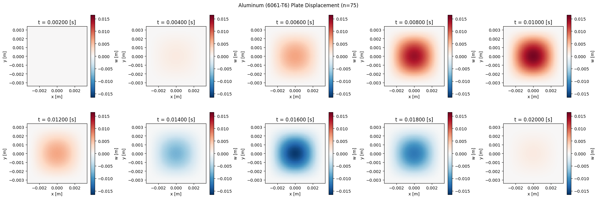
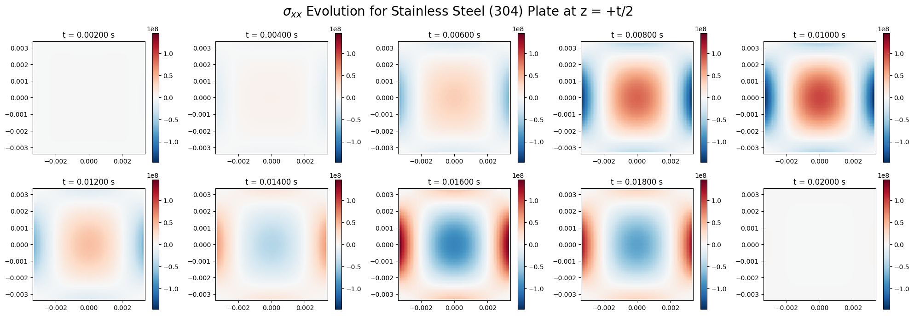

# AE370_Group_Project_2
This repository was created for the AE370 Project 2. 

# AE370 Group Project - Kirchhoff-Love Plate Dynamics Simulation

This repository contains a numerical simulation of transient dynamics of a thin plate using the Kirchhoff-Love plate theory. We solve the plate equation using finite differences in space and the Newmark-beta method in time to analyze the dynamic response of aircraft panel structures under impulsive loading.

The project includes Python scripts for computing the plate dynamics, stress analysis, and visualizing the results.

---

## 📁 Contents

* `plate_solver.ipynb` — Main simulation script implementing the finite difference discretization and Newmark-beta time integration for the Kirchhoff-Love plate equation.
* `Images/` — Directory containing output figures (displacement snapshots, convergence plots, stress distributions).
* `README.md` — This file.
* `AE370_Plate_Report.pdf` — Formal project report.

---

## 🧠 Project Overview

This project numerically solves the Kirchhoff-Love plate equation:

$$
\rho h \frac{\partial^2 w}{\partial t^2} + K_1 \frac{\partial w}{\partial t} + K_0 w - T\nabla^2 w + D\nabla^4 w = F(x,y,t)
$$

where:
- $w(x,y,t)$ is the transverse displacement
- $\rho$ is the material density
- $h$ is the plate thickness
- $K_0$ is the elastic foundation stiffness
- $K_1$ is the viscous damping coefficient
- $T$ is the in-plane tension
- $D = \frac{Eh^3}{12(1-\nu^2)}$ is the flexural rigidity
- $F(x,y,t)$ is the external forcing

### Numerical Methods

**Spatial Discretization:**
- 5-point stencil for the Laplacian (∇²)
- 13-point stencil for the Biharmonic (∇⁴)
- Clamped boundary conditions with ghost points

**Temporal Discretization:**
- Newmark-beta method (β = 1/4, γ = 1/2)
- Unconditionally stable, second-order accurate

---

## 🔬 Materials Analyzed

| Material | E (GPa) | ν | ρ (kg/m³) |
|----------|---------|------|-----------|
| Aluminum (6061-T6) | 68.9 | 0.33 | 2700 |
| Stainless Steel (304) | 193 | 0.29 | 8000 |
| Titanium (Ti-6Al-4V) | 113.8 | 0.34 | 4430 |

---

## 📊 Key Results

### Displacement Evolution


### Spatial Convergence (O(Δx²))


### Stress Distribution


---

## ⚙️ Requirements

Make sure you have the following installed:

* Python 3.8+
* NumPy
* SciPy
* Matplotlib

Install dependencies:
```bash
pip install numpy scipy matplotlib
```

---

## 🚀 Usage

1. Clone the repository:
```bash
git https://github.com/NikosMonogyios/AE370_Group_Project_2.git
cd AE370_Plate_Dynamics
```

2. Run the main simulation:
```bash
jupyter notebook plate_solver.ipynb
```


---

## 👥 Team Contributions

| Member | Contribution | Role |
|--------|--------------|------|
| **Nikolaos Monogyios** | 25% | Developed the numerical solver, spatial discretization, and truncation error analysis. |
| **Will Brizzolara** | 25% | Analyzed simulation results and researched material parameters. |
| **Gabriel Esquivel** | 25% | Wrote the problem formulation, boundary conditions, and document structure. |
| **Ka'inoa Lugo** | 25% | Derived the time integration scheme and validated the Newmark-beta method. |

---

## 📚 References

1. **Liu, X.** (2024). "Impact response and crashworthy design of composite fuselage structures: An overview." *Progress in Aerospace Sciences*. [[Link]](https://www.sciencedirect.com/science/article/pii/S0376042124000289)

2. **Jia, S.** (2024). "Numerical study on the impact response of aircraft fuselage structures subjected to large-size tire fragment." *Scientific Reports*. [[Link]](https://pmc.ncbi.nlm.nih.gov/articles/PMC10453686/)

3. **Nguyen, D.T.A.** (2022). "Stable and Accurate Numerical Methods for Generalized Kirchhoff-Love Plates." *arXiv preprint*. [[Link]](https://arxiv.org/pdf/2008.01693)

4. **Nizampatnam, L.S.** (2018). "Finite Element Modelling for Bird Strike Analysis and Review of Existing Numerical Methods." *Technical Report, Wichita State University*. [[Link]](https://soar.wichita.edu/server/api/core/bitstreams/b63e0d48-a5fd-425f-b034-574267ca1582/content)
